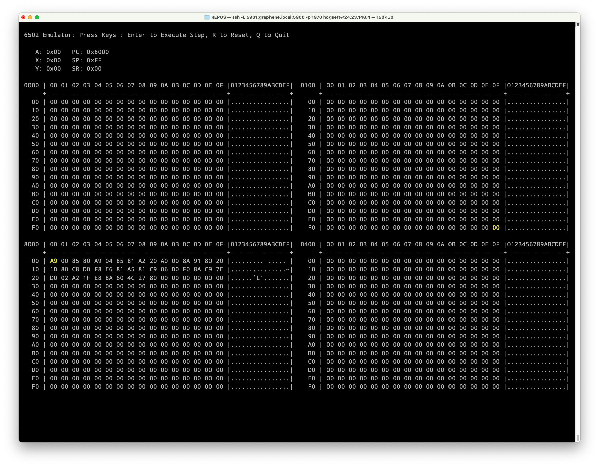

# 6502 Emulator

A minimal, single-stepped and beginner friendly 6502 emulator written
in C using ncurses for graphics.



## DISCLAIMER

This main goal of this project is to understand how CPUs works by
directly emulating one and to debug it by single stepping
instructions. The code is meant to be readable and understandable, a
lot of things could be done better, especially the graphics.

The emulator only shows you what's going on under the hood of a 6502
CPU, without displaying stuff graphically (you will only see hex
digits). The example program simply caluclates `10*3` and it's not
optimized.

## Run

You must have `ncurses` installed on your machine. This project was
developed in a Linux environment.

```
make
```

```
./bin/emulator.out
```

Or you can run the _shortcut_ script

```
./run.sh
```

Note: the run script will run make then if the exit code is not an error will run bin/emulator.out

### Loading a custom program

By default, the emulator loads `example.bin`. If you want to load a
custom binary file, just provide the path as the second argument while
launching the emulator:

```
./bin/emulator.out your_binary_here
```

## Code style

The paradigm I've chosen is `modular programming`, especially because
this is C. System components aren't defined in a OOP way.

Everything is very verbose with a lot of comments.

## Design

The project is divided in multiple components:

-   **cpu**: here you will find the CPU itself, including main methods to interact with the memory
    -   **instructions handler**: here we handle OP codes
-   **mem**: pretty simple memory implementation, each page has a dedicated array
-   **peripherals**
    -   **interface**: everything ncurses related
    -   **keyboard handler**: listener for key presses

## Dump feature

After quitting, the program dumps its memory to a `.bin` file.

## Example program

The example program source code is stored in 6502-src/.  Compile with the [VASM](http://sun.hasenbraten.de/vasm/) compiler.

## TODO

Do you want to contribute? Here are some things that are still a WIP.

-   [x] check for errors on cpu_fetch() calls
    -   due to uint16_t always being between `0x0000` and `0xFFFF` we don't have to perform extra checking while fetching memory.
-   [ ] add remaining comments to `instructions.c`
-   [x] create a better interface
-   [ ] convert argument processing to getopt / getoptlong
-   [x] add the possibility to load custom programs
-   [ ] add the possibility to load custom programs at specific memory locations
-   [ ] abstract all memory access through a read and write function
-   [ ] add highlighting of the last memory read or write
-   [ ] add the ability to set the third memory display to follow the PC page
-   [ ] add ability to set the address for the fourth memory display


## References

-   [obelisk.me.uk/6502](http://www.obelisk.me.uk/6502/)
